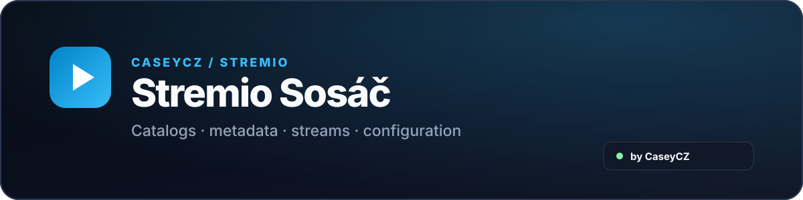

  

  
  

  An unofficial community <strong>Stremio</strong> add-on focused on catalogs, metadata and playback streams from <strong>Sosáč / Streamuj.tv</strong>.

  
  
  

  
  
  

## Quick installation

1. Open **Addon Configuration** using the button above.
2. Choose the metadata language.
3. Enter credentials for the sources you use.
4. Click **Generate installation link**.
5. Copy the link or open it directly in Stremio.

> The installation link may contain sensitive data. Do not share it publicly or include it in screenshots.

## Features

| Feature | Description |
| --- | --- |
| 🎬 **Movies & series** | Catalogs and playback streams from Sosáč / Streamuj.tv. |
| 🔍 **Search** | Custom catalogs and title search directly in Stremio. |
| 🔗 **Metadata** | IMDb / Cinemeta integration and title information. |
| 🇨🇿 **Audio variants** | Czech, Slovak and other available audio variants depending on source. |
| 📺 **Multiple qualities** | Shows available playback qualities. |
| 🖼️ **Posters & descriptions** | Cleaner title presentation inside Stremio. |
| ⚡ **Cache** | Faster repeated loading of processed data. |

## Two separate add-ons

Video playback and subtitles are maintained as two separate projects:

<table>
  <thead><tr><th>Add-on</th><th>Purpose</th><th>Link</th></tr></thead>
  <tbody>
    <tr><td><strong>Stremio Sosáč</strong></td><td>Catalogs, metadata and video streams.</td><td></td></tr>
    <tr><td><strong>Sosáč Subtitles</strong></td><td>Separate subtitle add-on.</td><td></td></tr>
  </tbody>
</table>

## Compatibility

Designed for common Stremio clients on **PC, Web, Android / Google TV and Apple devices**. Available behavior may differ depending on the client and player.

## Privacy & credentials

The configuration page generates an installation link with settings stored as **Base64URL**.

**Base64URL is not encryption.** The installation link may contain sensitive login data and should not be shared publicly, logged, or included in screenshots.

## Technology

  
  
  
  
  

## References

- [Sosáč official Kodi repository](https://sosac.tv/sosacRepo/)
- [kodi-czsk / plugin.video.sosac.ph](https://github.com/kodi-czsk/plugin.video.sosac.ph)
- [Matt5454 / Sosio](https://github.com/Matt5454/Sosio)
- [Stremio Addon SDK documentation](https://stremio.github.io/stremio-addon-guide/)
- [Sosáč.tv](https://sosac.tv/)
- [Streamuj.tv](https://www.streamuj.tv/)

## Disclaimer

This is an unofficial community add-on and is not officially affiliated with or supported by **Stremio, Sosáč.tv, Streamuj.tv, Cinemeta or Trakt**.

This repository does not host video content. Stream and metadata availability depends on external services.

## CaseyCZ

  
  

